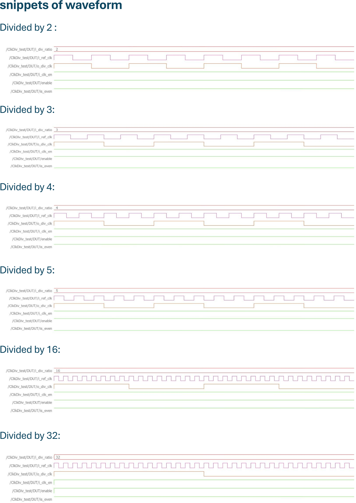
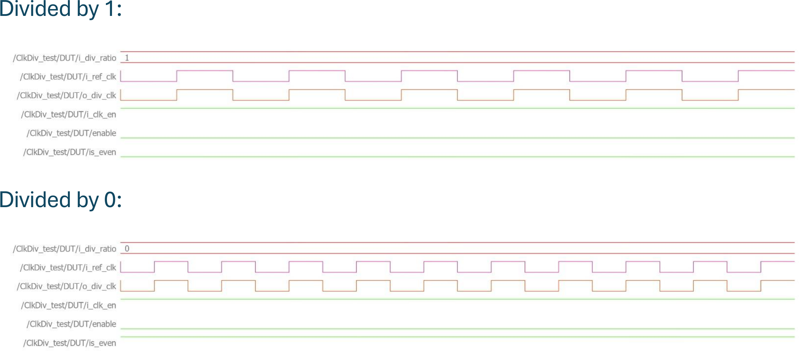

# ClkDiv — Integer Clock Divider

An integer clock divider I implemented in Verilog, supporting both even and odd division ratios with a 50% duty cycle output.

## About the Design

The module takes a reference clock `i_ref_clk` and produces a divided clock `o_div_clk` such that `fout = fin / n`, where `n` is set by `i_div_ratio`.

- **Even ratios** are generated using a single posedge-triggered counter that toggles the output.
- **Odd ratios** are generated by combining two toggle signals — one derived from the posedge counter and one from the negedge counter — and OR-ing them together to keep the duty cycle balanced.
- The divider is only enabled when `i_clk_en` is high **and** `i_div_ratio` is neither 0 nor 1:
  ```
  enable = i_clk_en && (i_div_ratio != 0) && (i_div_ratio != 1)
  ```
- When disabled, `o_div_clk` passes `i_ref_clk` through directly.

### Ports

| Signal        | Direction | Width | Description                       |
|---------------|-----------|-------|-------------------------------------|
| `i_ref_clk`   | input     | 1     | Reference clock                     |
| `i_rst_n`     | input     | 1     | Active-low asynchronous reset       |
| `i_clk_en`    | input     | 1     | Clock divider enable                |
| `i_div_ratio` | input     | 8     | Division ratio (integer value)      |
| `o_div_clk`   | output    | 1     | Divided output clock                |

## Repository Structure

```
rtl/            → design source file
tb/             → testbench and simulation scripts
lint_reports/   → lint check report
docs/images/    → simulation waveforms
```

## Simulation Results

Verified divided clocks for both even and odd ratios (2, 3, 4, 5, 16, 32):



Corner cases — `i_div_ratio = 1` and `i_div_ratio = 0` correctly disable the divider and pass `i_ref_clk` through:



## Tools Used

- Simulation: ModelSim/QuestaSim
